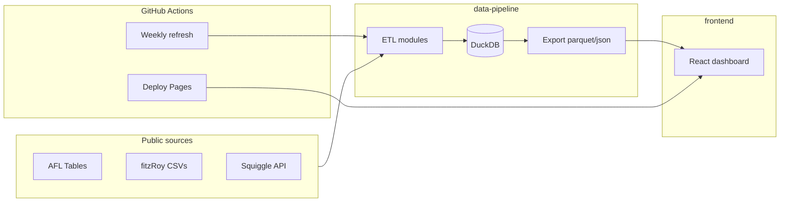

# Architecture

## Goal

Injury-adjusted AFL team performance: quantify unavailable player value per round and relate it to wins, ladder, and form.

## Principles

- **Explainable** — transparent PVS and linear/ridge models first
- **Static frontend** — GitHub Pages consumes pre-built JSON/Parquet
- **Reproducible ETL** — Python modules, DuckDB, weekly GitHub Actions
- **Graceful gaps** — partial VFL data, schema drift logging

## System diagram



## Availability model (Phase 1)

| Observation | Status |
|-------------|--------|
| Selected AFL | Available (AFL) |
| VFL only | Partial (VFL) |
| No AFL or VFL | Unavailable |

No official injury lists in v1.

## Player Value Score (Phase 2)

```
PVS = w_age(age) * Performance + (1 - w_age(age)) * Potential
```

- **Performance**: rolling multi-year stats, games, disposals, score involvements
- **Potential**: nonlinear draft-pick curve
- **w_age**: smooth curve (e.g. 18 → 30% perf; 25+ → 100% perf)

## Unavailability metrics (per team, round)

- Total unavailable PVS
- Top-5 / top-10 unavailable PVS
- By age cohort
- Continuity (archetype-level lineup changes)

## Storage

| Layer | Format |
|-------|--------|
| Raw | CSV / API snapshots in `data-pipeline/raw/` |
| Processed | DuckDB tables |
| Frontend | `shared/output/*.json` (compressed) |

## Frontend pages

1. League overview
2. Club detail
3. Season explorer
4. Player explorer
5. Unavailability trends
6. Model insights

Filters: club, season, round, age cohort, player tier.
